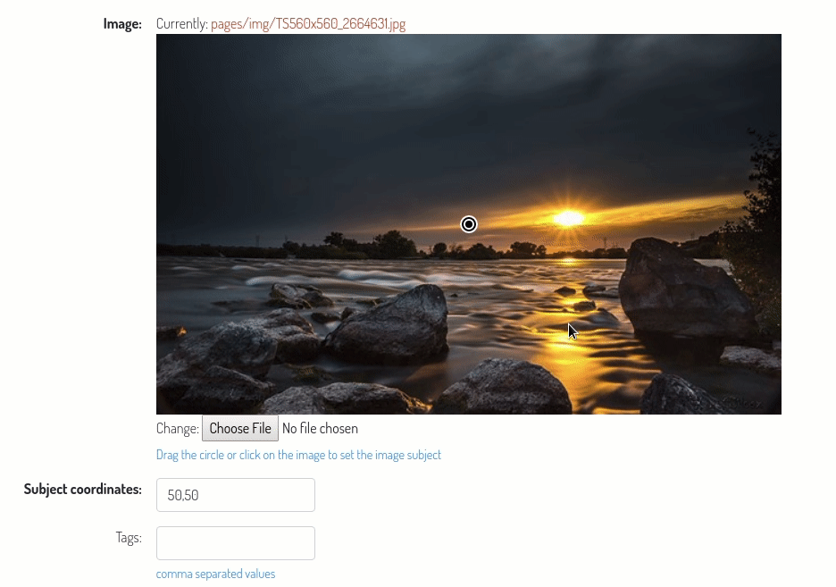

# django-subject-imagefield

This package provides a `SubjectImageField` model field which inherits from the core `ImageField` and adds support for subject position.
The position coordiantes are stored inside another model field defined as an option (as it occurs with the width and height optional ImageField parameters).
A custom form field and widgets are used in order to allow the user to easily set the image subject dragging a pin over an image preview.
Some convenience properties are added to the `attr_class` of the field in order to access the subject position coordinates in a template.

Use it together with some sort of thumbs generator application in order to show always the relevan part of an image, I find it playing well with [sorl-thumbnail](https://github.com/jazzband/sorl-thumbnail).

Tested for django >= 1.11

## Installation

Install with pip

    $ pip install django-subject-imagefield

Add it to your installed apps:

    INSTALLED_APPS = {
        #...
        subject_imagefield,
    }

## Configuration

You can set the image preview width for the widget:

    SUBJECT_IMAGEFIELD = {
        'PREVIEW_WIDTH': 500
    }

Value is considered as number of pixels, default: 300.

## Usage

In you models:

    from subject_imagefield.fields import SubjectImageField

    class MyModel(models.Model):
        image = SubjectImageField('image', upload_to='pages/img', subject_location_field='subject_location')
        subject_location = models.CharField('subject coords', max_length=7)

In a django template you've access to the following properties:

- __subject_perc_position__: a dictionary containing the subject position in percentage coordinates, i.e: `{'x': 15, 'y': 37}`
- __subject_position__: a dictionary containing the subject position coordinates in px relative to the original image dimensions, i.e: `{'x': 700, 'y': 345}`
- __sorl__: a shortcut to get a string used as cropping paramenter for sorl-thumbnail templatetag, i.e: `'15% 37%'`

Example:

    

    
Perc. subject position: {{ object.image.subject_perc_position }}

    
Original dimensions subject position: {{ object.image.subject_position }}

    
Thumb cropped considering subject position:

    
    
    
